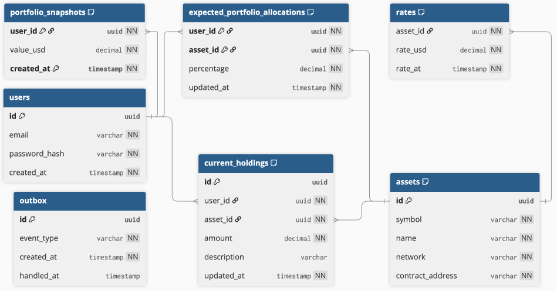
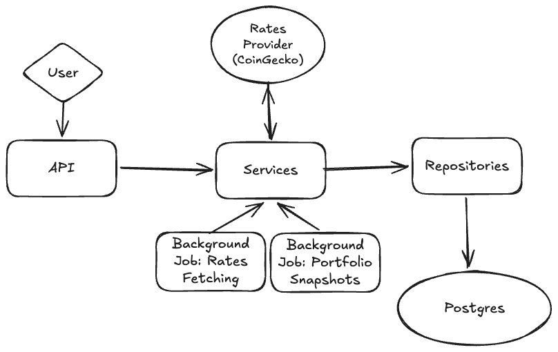

# Portfolio Tracker Backend

A REST API built in Rust (Axum) for tracking crypto portfolio allocations and historical value.

## Table of Contents

* [Context](#context)
* [Tech Stack](#tech-stack)
* [Architecture](#architecture)
    * [Database Model](#database-model)
    * [Project Structure](#project-structure)
* [Domain Glossary](#domain-glossary)
* [API Endpoints](#api-endpoints)
    * [Auth](#auth)
        * [Example](#example)
    * [Assets](#assets)
        * [Example](#example-1)
    * [Portfolio](#portfolio)
        * [Example](#example-2)
    * [Health](#health)
* [Running Locally](#running-locally)
* [Running with Docker](#running-with-docker)
* [Design Decisions](#design-decisions)
    * [Scheduled Jobs](#scheduled-jobs)
        * [Portfolio Snapshots Job](#portfolio-snapshots-job)
        * [Rates-Fetching Job](#rates-fetching-job)
    * [Repositories](#repositories)
    * [Infrastructure](#infrastructure)
* [Testing Strategy](#testing-strategy)
* [Improvements](#improvements)
* [AI Usage](#ai-usage)

## Context

As a Scala engineer trying to rotate into Rust positions, I wanted a project to work on to learn the language. Thus, I
created a portfolio tracker for myself fully written in Rust. This project is a lot more thorough than needed for a
personal project, but I wanted to show how I would design and code inside a company.

## Tech Stack

Fully written in Rust.

- `tokio` for the async runtime
- `axum` for the API layer. Tower for middleware
- `reqwest` for the HTTP client
- `sqlx` for the DB connection layer

- `serde` for Serialization/Deserialization
- `thiserror` for error modeling
- `tracing` for logging/tracing

Other crates for misc needs, like `itertools` and `validator`.

`PostgreSQL` for persistence. `Coingecko` as a rates' provider.

## Architecture

### Database Model



### Project Structure

Everything a `src` root is needed for the app to run. `lib.rs` is used to make dependencies available to the tests.
Every
module at `src` is responsible for its own thing:

- `api`: Api Layer Concern
- `auth`: Authentication (And later Authorization) needs
- `client`: HTTP Client
- `jobs`: Background jobs definition
- `model`: Domain models shared across all modules
- `repository`: Everything to do with the DB
- `service`: This is where the traits (HTTP Client, Repositories) are composed into the business logic of the app

This is a CRUD app.



Every API call that comes gets delegated to the different services, where all the business logic lies. There are two
background jobs:

- Rates Fetching: Every 1 hour, the app fetches rates for all known assets and persists them in the DB.
- Portfolio snapshotting: To be able to have historical portfolio values and be able to see evolution, this job takes a
  snapshot of user portfolios values and stores them. This is done once everytime rates get persisted, but the
  snapshotting job itself is not sequential to the rates job, as it's a standalone job by itself.

The portfolio snapshotting job is a job by itself to simulate standalone-running consumer from a message-queue that
would react to a `RatesInserted` event. For this app specifically, I instead went with an outbox pattern. When rates are
inserted, a `RatesInserted` event is inserted into the outbox table inside the same DB transaction, to ensure once
delivery.

In a prod setup, we cannot guarantee message delivery to the message-queue (Like Kafka) after inserting the
rates in the DB. A setup that would yield the same result but with kafka instead of the outbox table would be to use
Change-Data-Capture (CDC) (with [Debezium](https://debezium.io) for example) to react directly on the database changes
from the write-ahead log. For this project I deemed this overkill.

## Domain Glossary

- Asset: a tradeable token (symbol + network + contract)
- Allocation: target % of portfolio for an asset
- Holding: actual amount held, possibly multiple per asset
- Snapshot: portfolio total value at a point in time

## API Endpoints

All `/api` routes require `Authorization: Bearer <token>`.

### Auth

| Method | Path             | Description                        |
|--------|------------------|------------------------------------|
| POST   | `/auth/register` | Register a new user, returns a JWT |
| POST   | `/auth/login`    | Login and returns a JWT            |

#### Example

```http request
GET localhost:3000/auth/login
Content-Type: application/json

{
    "email": "test@email.com",
    "password": "my_strong_pwd"
}
```

```json
{
  "token": "...",
  "token_type": "Bearer"
}
```

### Assets

| Method | Path          | Description     |
|--------|---------------|-----------------|
| GET    | `/api/assets` | List all assets |
| POST   | `/api/assets` | Create an asset |

#### Example

```http request
GET localhost:3000/api/assets
Authorization: Bearer {{jwt_token}}
Content-Type: application/json
```

```json
[
  {
    "id": "d54db579-a71d-429a-a451-f1bc3c62d6cb",
    "symbol": "JITOSOL",
    "name": "Jito Staked SOL",
    "network": {
      "id": "solana",
      "display_name": "Solana"
    },
    "contract_address": "J1toso1uCk3RLmjorhTtrVwY9HJ7X8V9yYac6Y7kGCPn"
  }
]
```

### Portfolio

| Method | Path                                    | Description                                           |
|--------|-----------------------------------------|-------------------------------------------------------|
| PUT    | `/api/portfolio/allocations/{asset_id}` | Create or Update an asset allocation for the user     |
| DELETE | `/api/portfolio/allocations/{asset_id}` | Delete an asset allocation                            |
| POST   | `/api/portfolio/holdings`               | Create a holding for the user                         |
| PATCH  | `/api/portfolio/holdings/{holding_id}`  | Update a holding for the user                         |
| DELETE | `/api/portfolio/holdings/{holding_id}`  | Delete a holding for the user                         |
| GET    | `/api/portfolio`                        | Return the whole user portfolio                       |
| POST   | `/api/portfolio/refresh`                | Refreshes prices and returns the whole user portfolio |

#### Example

```http request
GET localhost:3000/api/portfolio
Authorization: Bearer {{jwt_token}}
Content-Type: application/json
```

```json
{
  "expected_asset_allocations": [
    {
      "asset": {
        "id": "d54db579-a71d-429a-a451-f1bc3c62d6cb",
        "symbol": "JITOSOL",
        "name": "Jito Staked SOL",
        "network": {
          "id": "solana",
          "display_name": "Solana"
        },
        "contract_address": "J1toso1uCk3RLmjorhTtrVwY9HJ7X8V9yYac6Y7kGCPn"
      },
      "allocation_pct": 0.2
    }
  ],
  "holdings": {
    "holdings": [
      {
        "asset_rate": {
          "asset": {
            "id": "d54db579-a71d-429a-a451-f1bc3c62d6cb",
            "symbol": "JITOSOL",
            "name": "Jito Staked SOL",
            "network": {
              "id": "solana",
              "display_name": "Solana"
            },
            "contract_address": "J1toso1uCk3RLmjorhTtrVwY9HJ7X8V9yYac6Y7kGCPn"
          },
          "rate_usd": 107.5373289623
        },
        "total_value_usd": 967.8359606607,
        "holdings": [
          {
            "id": "5fc287cc-9a4e-4fbf-a73c-7e655365fbaf",
            "amount": 4.5,
            "value_usd": 483.91798033035,
            "description": "Phantom Wallet !",
            "current_allocation_pct": 0.5
          },
          {
            "id": "392807ee-0ed8-4b1a-99ef-0794ed894518",
            "amount": 4.5,
            "value_usd": 483.91798033035,
            "description": "LP on Jup",
            "current_allocation_pct": 0.5
          }
        ],
        "total_allocation_pct": 1.0,
        "expected_allocation_pct": 0.2,
        "drift_pct": 0.8
      }
    ],
    "portfolio_value_usd": 967.8359606607
  },
  "historical_portfolio_value": [
    {
      "value_usd": 967.6992484647,
      "at": "2026-05-04T15:53:18.014727Z"
    },
    {
      "value_usd": 0.0,
      "at": "2026-05-04T15:37:29.086973Z"
    }
  ]
}
```

### Health

Used for deployment checks.

| Method | Path            | Description                    |
|--------|-----------------|--------------------------------|
| GET    | `/health/live`  | Checks if app is running       |
| GET    | `/health/ready` | Checks if app can reach the DB |

## Running Locally

You need to define env vars. You have an example in [.env.example](.env.example)

```bash
docker compose -f docker-compose.dev.yml up -d # Run local instance of the DB
cargo run
```

## Running with Docker

You need to define .env.production. You have an example in [.env.example](.env.example)

```bash
docker-compose up -d
```

## Design Decisions

### Scheduled Jobs

I went with in-code scheduled jobs because this will be a single instance for my needs. A prod context would probably
have multiple instances, so I would instead setup a K8S CronJob that would call an internal HTTP route for the jobs to
ensure only 1 instance runs the job.

#### Portfolio Snapshots Job

1. The job takes current holdings into account to calculate. I chose this method because I wasn't interested
   in having historical holdings data (at least for now). If the snapshots were to be taken with historical holdings, I
   would need to not delete holdings and instead invalidate them, so I could keep the historical holdings and this way
   calculate portfolio snapshots with those. This is a design decision that suits my current needs.
2. The job currently processes all users at once. While this is okay for a service of this scale (single
   user), it would be a good idea to enqueue jobs for ranges of users instead for a service with multiple users to
   prevent self-DoS

#### Rates-Fetching Job

With the number of assets/network I have I don't need enqueuing to prevent rate-limiting CG side, but this would be
needed for a proper prod setup.

### Repositories

1. Some calls are standalone, and other require a transaction through `tx: &mut PgTransaction`. This is to model, in the
   function signature, that this DB call needs to be called inside a transaction context. Current needs are:
    1. Persisting rates + RatesInserted event in the outbox table.
    2. Handling portfolio snapshots + Setting outbox events as handled
2. "Enums" present in the DB are handled directly in code, so there aren't enum types defined in the DB directly. This
   makes manual updating of rows more fragile, but:
    1. This shouldn't happen
    2. In an enterprise context, write access would be given only to SREs in specific cases which would prevent
       accidental
       updates with wrong values
3. `PgPool::clone` uses `Arc` internally so it's safe to clone, same for the `CGClient` with `reqwest::Client`

### Infrastructure

1. Rate limiting isn't in this app as I would put in at deployment level behind a WAF (With a K8S service for example)
2. As a purely personal project, there's no SSL as that's an infra issue I don't have as I use my app through SSH. In
   prod, I would've a Let's Encrypt + Certbot setup

## Testing Strategy

- Unit tests: Only used for specific pure parts of the code, like mappers or private functions. Those are either inline
  if tiny, or in a `tests` module at the same level of the underlying code,
  like [/src/client/tests.rs](/src/client/tests.rs)

Integration tests

- DB calls are always tested through repositories IT tests. They use `testcontainers`.
- Service tests are only written if there is more logic than just calling the DB. Some examples are:
    - Ensuring the outbox event is written in the same transaction as the rates' persistence.
    - Getting the whole portfolio, as it contains semi-complex business logic.
- API routes: Mainly used for Auth and to ensure proper validation on the `assets` endpoint.

Tests are ran by doing:

```bash
cargo test
```

## Improvements

- As discussed in previous chapters:
    - Enqueuing portfolio snapshotting for ranges of users to prevent self-DoS if a lot of users use the app.
    - Enqueuing rates fetching to prevent getting rate-limited by CoinGecko.
- Metrics: Add OpenTelemetry to collect metrics like: Overall app resource usage, IO, DB response times per query,
  number of calls per API endpoint, etc.
- Add proper tracing between service calls. Currently, the logs don't have a tracing context that can be useful to trace
  down exact issues in prod when they happen.
- Obviously an asset has different representations. It can be multichain and can even be native to a specific chain (
  Bitcoin, Solana). For the needs of this portfolio tracker, I took the decision to go with a simple (Symbol, Network,
  Contract Address) definition, with a private internal id. Whilst this is okay here, for a proper company FinTech
  setup, a given asset should be able to have different representations possible, that would come either with a
  different table, or with a jsonb column with a 2 model ADT (Native, Token).

## AI Usage

As AI usage is very common these days, I felt like writing this chapter. With this project, I wanted to learn Rust. For
this reason, all the code is written by myself.

I used AI a lot to learn, as before starting the project, I didn't know which frameworks were usually used for features.
My usual flow was to ask for code snippets to have an overall example, and then wrote the code myself. There wasn't
any "Write me this feature while I do something else".

I periodically asked Claude to roast my code. I might know how to code, but having never seen Rust production code
before, I don't know what is or isn't idiomatic. I took the critiques of the code that I felt made sense, and fixed them
myself.

Only for stuff like the nginx config and Dockerfile did I paste the code from Claude with minimal edits from myself.
